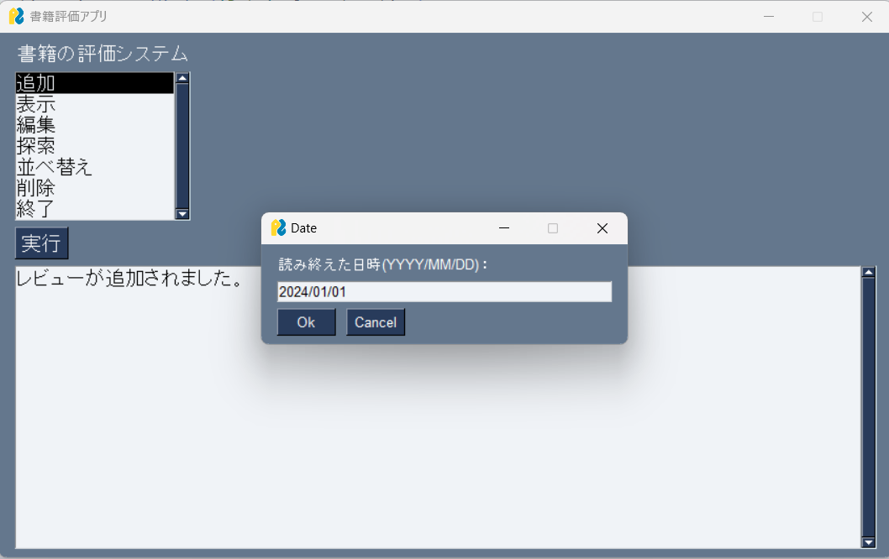
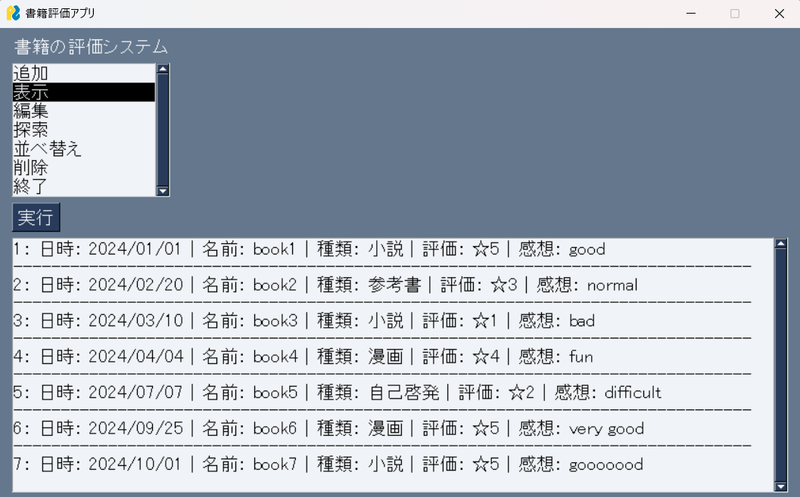
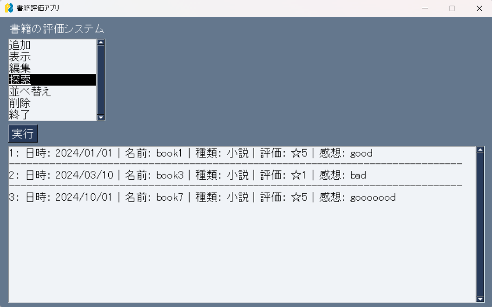
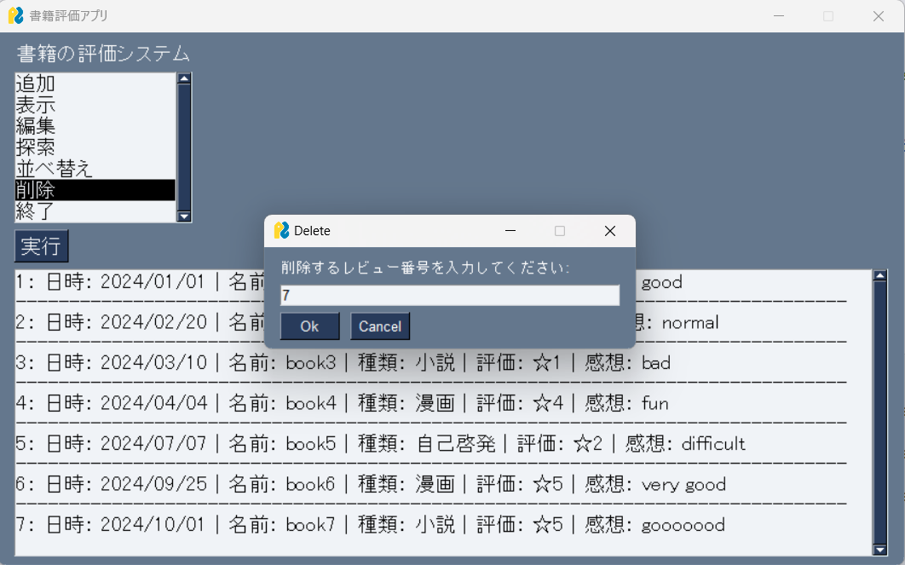

# 書籍記録アプリケーション
## 概要
このアプリは，書籍を簡単に記録できるコンソールアプリケーションです．評価は指定されたテキストファイルに保存され，プログラムの再起動後も保持されます．
また，PySimpleGUIライブラリを使用して，使いやすいインタフェースを提供しています．

## 使用方法
### 必要環境
- Python: Python 3.11.0がインストールされていることを確認してください．
- ライブラリ: PySimpleGUI: (インストールコマンド: 'pip install PySimpleGUI')

### 使用方法
1. 必要なファイル
このプログラムは，記録を保存するために'review_list.txt'というファイルを使用します．プログラムが初めて実行されるとき，このファイルが存在しない場合は自動的に作成されます．
2. 実行手順
   1. プログラムの起動: review.pyというプログラムを使用したときの起動方法を記載します． 
      ```bash
      python 書籍記録アプリ.py
      ```
   2. 選択画面:
   プログラムが起動すると，記録に対する処理を選択する画面が表示されます．利用できる処理は以下の通りです：
      - '追加': 新しい記録を追加します．
      - '表示': 全ての記録を一覧表示します．
      - '編集': 指定した記録を編集できます．
      - '探索': 指定したジャンルのみを表示します．
      - '並べ替え': 評価順で並び替えて表示します．
      - '削除': 指定したの記録を削除します．
      - '終了': プログラムを終了します．

   3. コマンドの詳細
      - 追加: '追加'を選択すると，以下の情報を順に入力する必要があります．
        - '読み終えた日時': YYYY/MM/DD形式で入力します．
        - '本の名前': 書籍のタイトルを入力します．
        - 'ジャンル': 書籍のジャンルを選択できます．
        - '評価': ☆1~☆5の範囲で選択します．
        - '感想': 書籍に関する感想を入力します．
        add.pngは追加を選択したときの読み終えた日時を入力するときの画面です．
        

      - 表示: '表示'を選択すると，全ての記録がインデックス番号付きで表示されます．print.pngは全ての記録の表示結果です．
        
  
      - 編集: '編集'を選択すると，編集したい記録のインデックス番号を入力するように求められます．番号を入力すると，既に登録されている情報を編集できるようになります．edit.pngは編集したい記録のインデックス番号の入力を求められている時の画面です．
        
  
      - 探索: '探索'を選択すると，探索したい書籍の種類を入力するよう求められます．書籍の種類は，小説・漫画・参考書・自己啓発本の4種類です．この中から1つを入力すると，該当する書籍のみが表示されます．search.pngは'小説'で探索した時の表示結果です．
        
 
      - 並べ替え: '並べ替え'を選択すると，並べ替え方法を入力するように求められます．並べ替え方法は，昇順と降順があります．どちらかを入力すると，入力した方法で評価順が並べ替えられて表示されます．sort.pngは昇順に並び替えた時の表示結果です．
        

      - 削除: '削除'を選択すると，削除したい記録のインデックス番号を入力するように求められます．番号を入力すると，その記録がリストから削除されます．delete.pngは削除したい記録のインデックス番号の入力を求められている時の画面です．
        

      - 終了: '終了'コマンドを入力すると，プログラムが終了します．

   4. ファイルの構造
   記録は'review_list.txt'に以下の形式で保存されます．
   ```markdown
   日時: YYYY/MM/DD｜名前: 書籍名｜種類: 書籍の種類｜評価: ☆1~☆5｜感想: 感想文
   ---------------------------------------------------------------------------
   ```

## 使用用途
### 読書記録の管理
本を読み終えた後，その本のタイトル，読了日，評価，感想を記録することで，自分が読んだ本の履歴を管理できます．これにより，どの本をいつ読んだかを簡単に振り返ることが出来ます．
### 読書習慣の追跡
読書の習慣を持っている人が，日々の読書活動を継続的に記録するのに便利です．読んだ本のリストを時系列で保存し，読書の進捗や傾向を把握することが出来ます．
### 感想の整理
読んだ本に対する感想や評価を記録しておくことで，将来的にその本について誰かと話すときや再読する際に参考にできます．また，記録しておくことで，自分の読書に対する理解や意見の変遷を追跡することもできます．

## 今後の展望
### 評価順ソート機能
- [x] 保存された評価で評価点が良かった順・悪かった順にソートして，評価の良かった・悪かった本をすぐに見つけられるようにしたいです．
### 記録の編集機能
- [x] 一度保存した記録に対して，内容の修正や評価の変更が簡単に行えるように，既存の記録を編集する機能を追加したいです．
### GUI
- [x] プログラムにGUIを導入して，コマンドラインではなく視覚的に操作できるインタフェースを提供したいです．これにより，操作が直観的になり，さらに使いやすくなると考えます．
### 記録のタグ付けとカテゴリ分け
- [x] 記録にタグを付けたり，ジャンルやテーマごとにカテゴリ分けを行う機能を追加したいです．これによって，記録の整理や特定のジャンルの本の記録を簡単に参照できるようになります．


## CHANGELOG

### [1.2.0] - 2024-10-03
#### Added
- 記録のタグ付けとカテゴリ分け機能の追加

### [1.1.0] - 2024-09-30
#### Added
- ソート機能の追加

### [1.0.0] - 2024-09-29
#### Added
- GUIの導入
- 編集機能の追加
